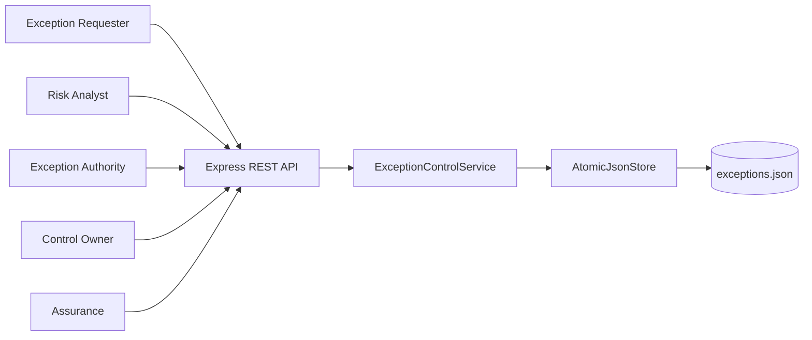
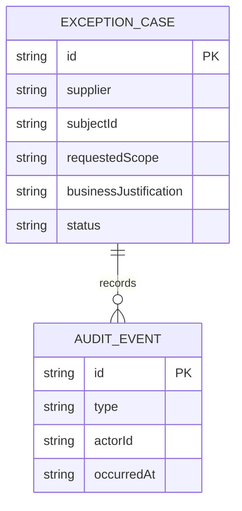
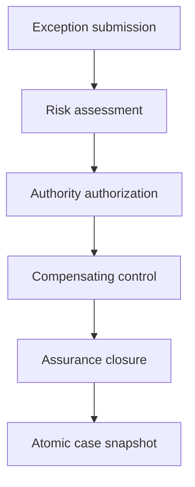
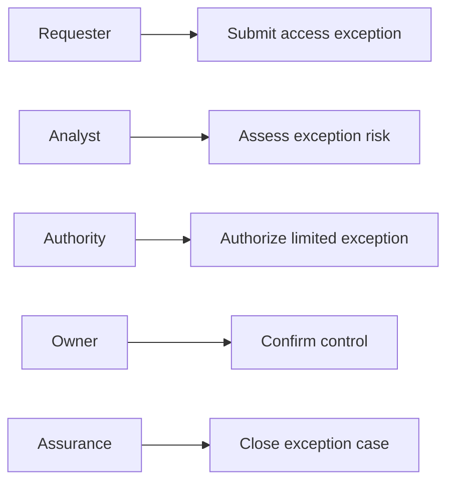
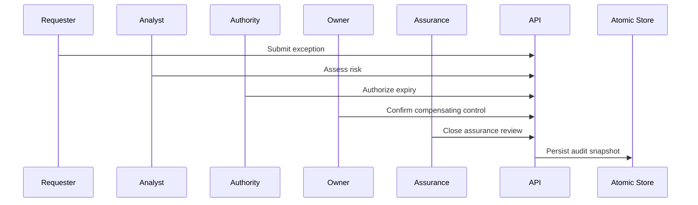

# Supplier Evidence Access Exception Control Platform

## The Problem

Supplier evidence access occasionally requires a time-bound exception, yet fragmented approval records make it difficult to prove whether the risk was assessed, the exception was explicitly authorized, and compensating controls were actually applied. Unstructured exceptions become standing access risks.

## The Solution

This service routes each exception through submission, risk assessment, authority authorization, compensating-control confirmation, and assurance closure. It enforces role ownership and lifecycle order for every mutation, appends immutable-style audit events to the case record, and saves the state atomically after accepted actions.

## Live Demo and Tech Stack

Start the service and visit `http://localhost:63100/health` to confirm readiness. The stack uses Node.js 22, Express 5, ESM JavaScript, atomic JSON persistence, Vitest, and GitHub Actions.

| Layer | Implementation | Responsibility |
| --- | --- | --- |
| HTTP API | Express 5 | REST lifecycle endpoints and structured errors |
| Control domain | ESM JavaScript | Authorization, state rules, and audit events |
| Persistence | Node file system | Temporary snapshot followed by atomic rename |
| Verification | Vitest and GitHub Actions | Workflow tests and continuous integration |

## Local Setup and Run Instructions

```bash
git clone https://github.com/kholipha-ahmmad-al-amin/supplier-evidence-access-exception-control-platform.git
cd supplier-evidence-access-exception-control-platform
npm install
npm test
npm start
```

The service binds to `0.0.0.0:63100` for approved local area network use.

## System Documentation

### System Architecture Diagram


### Entity-Relationship Diagram


### Data Flow Diagram


### Use Case Diagram


### Sequence Diagram


## Owner

Created and maintained by Kholipha Ahmmad Al-Amin.

Software Engineer and AI Specialist

Founder and CEO of EquiSaaS BD

Principal Consultant at AR IT Consultancy

Full Stack Developer and SaaS Product Builder

### Official links

Portfolio: https://kholipha-ahmmad-al-amin.equisaas-bd.com/

GitHub: https://github.com/kholipha-ahmmad-al-amin

LinkedIn: https://www.linkedin.com/in/kholipha-ahmmad-al-amin

X: https://x.com/al_amin5519

Facebook: https://www.facebook.com/kholipha.ahmmad.al.amin

Instagram: https://www.instagram.com/kholipha.ahmmad.al.amin

## Ownership

This project was created and is maintained by Kholipha Ahmmad Al-Amin.
